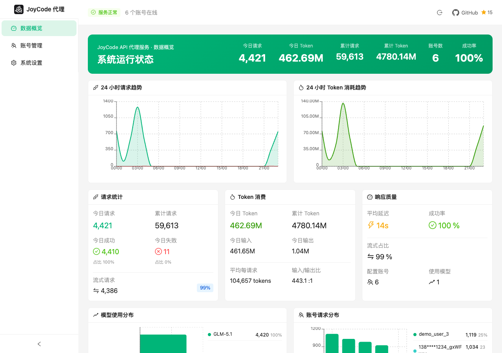
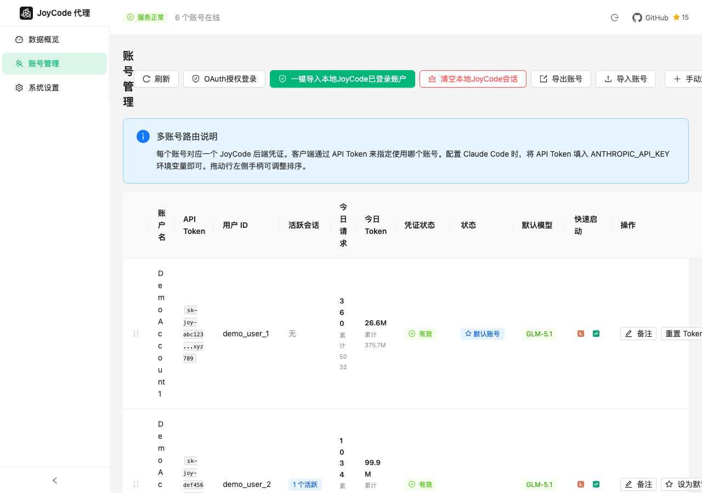
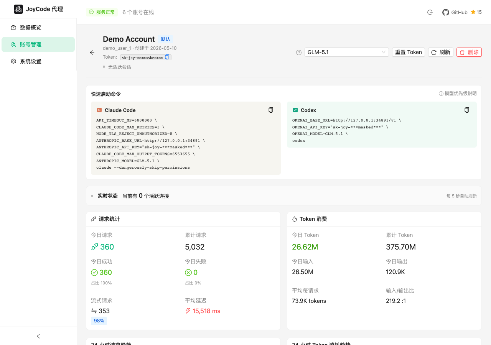
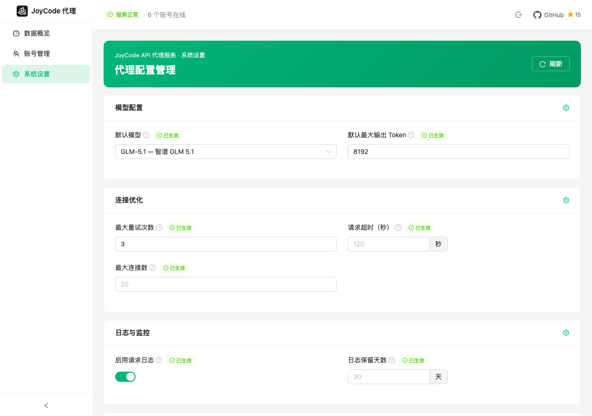

# AgnesCode2Api

[](https://go.dev/)
[](https://react.dev/)
[](./LICENSE)

---

## 这就是个问题

你有一个支持多种模型的 API 服务（AgnesCode）。你有一个想用的工具（Claude Code、Cursor）。它们之间的协议不兼容，接不上。

AgnesCode2Api 解决这个问题：它在中间把 AgnesCode 的 API 协议翻译成 Anthropic Messages API 和 OpenAI Chat Completions API 格式。改两个环境变量就能用。

---

## 功能

**协议翻译**
- Anthropic Messages API ↔ AgnesCode API
- OpenAI Chat Completions API ↔ AgnesCode API
- Tool Use 完整映射
- SSE 流式输出

**账号管理**
- OAuth 授权登录（支持 CSRF 防护）
- 一键导入本地 AgnesCode IDE 凭据
- 多账号，每个账号独立 API Key
- 拖拽排序，默认账号路由

**运维**
- 会话保活，自动刷新过期凭证
- 智能上下文截断
- 日志轮转
- 内置 Dashboard（React 19 + Ant Design）
- 单文件部署（前端嵌入 Go 二进制）

---

## 功能

**协议翻译**
- Anthropic Messages API ↔ AgnesCode API
- OpenAI Chat Completions API ↔ AgnesCode API
- Tool Use 完整映射
- SSE 流式输出

**账号管理**
- OAuth 授权登录（支持 CSRF 防护）
- 一键导入本地 AgnesCode IDE 凭据
- 多账号，每个账号独立 API Key
- 拖拽排序，默认账号路由

**运维**
- 会话保活，自动刷新过期凭证
- 智能上下文截断
- 日志轮转
- 内置 Dashboard（React 19 + Ant Design）
- 单文件部署（前端嵌入 Go 二进制）

---

## 快速开始

```bash
# 构建
cd web && npm install && npm run build && cd ..
go build -o agnescode_proxy_bin ./cmd/AgnesCodeProxy/

# 启动
./agnescode_proxy_bin serve

# 终端 2：连接到 Claude Code
export ANTHROPIC_BASE_URL=http://localhost:34891
export ANTHROPIC_API_KEY=agnescode
claude
```

### Docker

```bash
docker build -t agnescode-proxy .
docker run -p 34891:34891 agnescode-proxy
```

> 国内构建时如遇 Alpine 源连接失败，换用国内镜像：
> ```bash
> docker build --build-arg ALPINE_MIRROR=https://mirrors.aliyun.com/alpine -t agnescode-proxy .
> ```

---

## 添加账号

打开 `http://localhost:34891` 进入 Dashboard。

| 方式 | 说明 |
|------|------|
| **OAuth 授权登录** | 点击 → 跳转 AgnesCode 登录页 → 授权后自动添加 |
| **一键导入** | 本机已登录 AgnesCode IDE 时自动读取凭据 |
| **手动添加** | 已有 jwt_token 和 user_id 时直接填写 |

**远程部署的 OAuth 回调：** 授权完成后浏览器会跳转到 `http://127.0.0.1:34891/auth/callback`（这是正常的，因为回调地址指向本机）。把地址栏 URL 复制到弹窗输入框提交即可。

---

## API 端点

| 路径 | 协议 |
|------|------|
| `POST /v1/messages` | Anthropic Messages API |
| `POST /v1/chat/completions` | OpenAI Chat Completions API |
| `POST /v1/web-search` | 网页搜索 |
| `POST /v1/rerank` | 文档重排序 |
| `GET /v1/models` | 模型列表 |
| `GET /health` | 健康检查 |
| `GET /` | Dashboard |

---

## 项目结构

```
cmd/AgnesCodeProxy/    入口，HTTP 服务器，CLI
pkg/anthropic/         Anthropic 协议翻译
pkg/openai/            OpenAI 协议翻译
pkg/agnes/             AgnesCode API 客户端
pkg/auth/              凭据读取、JWT、中间件
pkg/store/             SQLite 存储
pkg/dashboard/         Dashboard API + 静态文件
pkg/keepalive/         会话保活
pkg/logrot/            日志轮转
pkg/proxy/             会话管理
web/                   前端（React 19 + Ant Design）
```

---

## 界面截图

<div align="center">

<p><sub>数据概览</sub></p>
</div>

<div align="center">

<p><sub>账号管理</sub></p>
</div>

<div align="center">

<p><sub>账号详情</sub></p>
</div>

<div align="center">

<p><sub>系统设置</sub></p>
</div>

---

## 使用限制

- 最多 10 个账号
- 使用前请阅读并遵守 AgnesCode 服务条款

---

## 许可证

Apache 2.0

---

> **免责声明：** 本项目仅供个人学习和技术研究使用。禁止用于商业转售、API 中转服务（中转站属于违法行为）、大规模薅号或任何黑灰产/违法违规活动。因不当使用造成的一切后果由使用者自行承担，与项目作者无关。本项目不是 AgnesCode 官方产品。